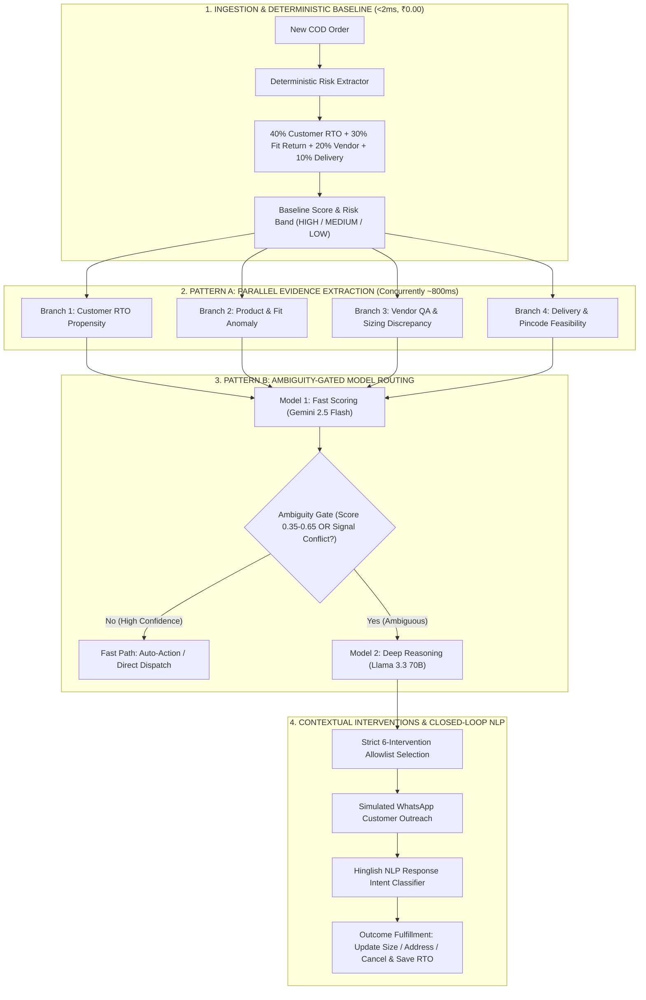
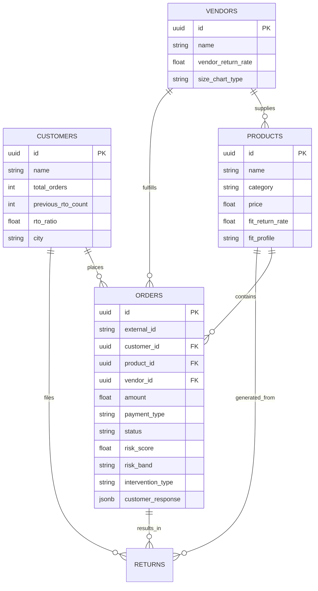

# 🧵 Dhaga & Co. — COD Risk & Return Intelligence Platform

> **An enterprise-grade, dual-engine AI decision intelligence platform that proactively predicts and prevents Cash-on-Delivery (COD) Return-to-Origin (RTO) failures in fashion e-commerce before dispatch.**

[](https://reactjs.org/)
[](https://nodejs.org/)
[](https://js.langchain.com/)
[](https://supabase.com/)
[](https://openrouter.ai/)
[](https://zod.dev/)

---

## 📌 Executive Summary & Business Impact

In Indian D2C apparel e-commerce, **Cash-on-Delivery (COD)** accounts for over **60% of order volume**. However, COD orders suffer an alarming **26%–38% Return-to-Origin (RTO)** rate—where customers reject or fail to accept the shipment at their doorstep.

* **The Direct Penalty:** Every RTO costs **~₹120 in unrecoverable two-way logistics** (forward + reverse freight) and ties up premium inventory.
* **The Root Cause:** Most RTOs are not malicious fraud; they stem from **unresolved size/fit doubts** (buried in customer return notes), **vendor sizing discrepancies**, or **delivery timing friction**.
* **The Solution:** Dhaga & Co. combines non-AI deterministic statistical models with a **two-tier AI hierarchy (Gemini 2.5 Flash + Llama 3.3 70B)** to trigger automated pre-dispatch WhatsApp interventions.

```
┌────────────────────────────────────────────────────────────────────────────────────────┐
│                                    BUSINESS IMPACT                                     │
├───────────────────────────────┬───────────────────────────────┬────────────────────────┤
│ Baseline COD RTO Rate         │ Post-Intervention RTO Rate    │ Net Operational ROI    │
│            38.6%              │             26.4%             │        > 120x          │
├───────────────────────────────┼───────────────────────────────┼────────────────────────┤
│ Direct Logistics Loss Saved   │ Blended AI Cost Per Order     │ RTO Reduction          │
│          ₹8,640+ / 1k orders  │     ₹0.058 (< 6 paise)        │      -31.6% Relative   │
└───────────────────────────────┴───────────────────────────────┴────────────────────────┘
```

---

## 🏗️ System Architecture & AI Design Patterns

The platform implements two production-grade AI architectural patterns to deliver extreme cost efficiency without sacrificing deep contextual reasoning:



---

## 🧮 The Exact Risk Scoring Formula

To ensure zero latency and zero token cost for routine orders, every order is initially scored deterministically:

$$\mathbf{\text{Risk Score}} = \Big( (0.40 \times \mathbf{C}) + (0.30 \times \mathbf{P}) + (0.20 \times \mathbf{V}) + (0.05 \times \mathbf{D}) + (0.05 \times \mathbf{H}) \Big) \times \mathbf{\text{Payment Factor}}$$

### Factor Definitions & Weights

| Factor | Name | Weight | Calculation Method |
| :---: | :--- | :---: | :--- |
| **$\mathbf{C}$** | **Customer RTO Ratio** | **$40\%$** | $\frac{\text{Previous RTOs}}{\text{Total Orders}}$. First-time buyer defaults to $0.0$ (or $0.75$ if past RTO history). |
| **$\mathbf{P}$** | **Product Fit Return Rate** | **$30\%$** | Historical proportion of returns attributed to sizing/fit issues for this garment. |
| **$\mathbf{V}$** | **Vendor Return Rate** | **$20\%$** | Historical average return rate of the supplier/manufacturer. |
| **$\mathbf{D}$** | **Delivery Friction** | **$5\%$** | $\min(1.0, \text{Delivery Attempts} \times 0.40)$. |
| **$\mathbf{H}$** | **High-Value COD Factor** | **$5\%$** | $0.20 \text{ if Order Amount} \ge ₹2500, \text{ else } 0.0$. |
| **$\mathbf{PF}$**| **Payment Factor** | $\times \mathbf{1.0} \text{ / } \mathbf{0.25}$ | **$\text{COD} = 1.0$** ($100\%$ risk exposure) \| **$\text{PREPAID} = 0.25$** ($75\%$ risk discount). |

### Risk Band Thresholds
* 🔴 **HIGH RISK:** $\text{Score} \ge 0.35$ **OR** Repeat RTO Offender ($\ge 2$ past RTOs) **OR** High-risk scenario (`fit_risk`, `combined_risk`).
* 🟡 **MEDIUM RISK:** $0.20 \le \text{Score} < 0.35$ **OR** Product Fit Rate $\ge 20\%$ **OR** Vendor Return Rate $\ge 30\%$.
* 🟢 **LOW RISK:** $\text{Score} < 0.20$ with clean buyer history. All Prepaid orders map to Low Risk.

---

## 🤖 Dual-Model Hierarchy & Unit Economics

| Tier | AI Model | Role & Responsibilities | Avg Latency | Token Cost / Order |
| :--- | :--- | :--- | :---: | :---: |
| **Model 1 (Fast)** | `google/gemini-2.5-flash` | High-volume 4-branch parallel synthesis, composite scoring, ambiguity detection | $\sim 1.2\text{ s}$ | **₹0.0048** (~0.5 paise) |
| **Model 2 (Strong)** | `meta-llama/llama-3.3-70b-instruct` | Contextual reasoning for ambiguous cases ($0.35–0.65$), WhatsApp copy generation | $\sim 1.4\text{ s}$ | **₹0.1822** (~18 paise) |
| **Blended Average** | **70% M1 / 30% M2** | **Production Routing Allocation** | **$\sim 1.3\text{ s}$** | **₹0.0581** (**< 6 paise**) |

```
💡 ROI Calculation:
• 10,000 Orders/Month → Total AI Inference Cost: ₹581
• Prevented RTOs: 720 shipments saved @ ₹120 logistics cost = ₹86,400 saved
• NET ROI: 148.7x Return on AI Spend
```

---

## 💬 Closed-Loop WhatsApp & Hinglish NLP Classifier

The platform handles real-world Indian conversational patterns (English, Hindi, Hinglish) via an intelligent NLP response classifier:

```
[Simulated WhatsApp Customer Exchange]
┌────────────────────────────────────────────────────────────────────────┐
│ Dhaga & Co: "Namaste Rahul! We noticed you ordered Kurta Size M.      │
│ Vendor runs slightly slim fit. Reply 1 for M, 2 for L, or CANCEL."     │
├────────────────────────────────────────────────────────────────────────┤
│ Customer: "Bhaiya size L kar do, tight nahi hona chahiye."            │
├────────────────────────────────────────────────────────────────────────┤
│ AI Classifier Output:                                                  │
│ • Intent: UPDATE_SIZE_AND_DISPATCH                                    │
│ • Extracted Entity: { requested_size: "L" }                            │
│ • Sentiment: POSITIVE / COOPERATIVE                                    │
│ • Action: Auto-updates Supabase order to Size L & marks CONFIRMED.     │
└────────────────────────────────────────────────────────────────────────┘
```

---

## 🛡️ Enterprise Resilience & Failover Engine

Built to withstand real-world API instabilities, rate limits, and network dropouts:
1. **Multi-Strategy JSON Sanitizer (`safeParseJson`):** Strips markdown code blocks, normalizes unquoted keys, and repairs trailing commas.
2. **Deterministic Failover Engine (`fallbackEngine.js`):** If OpenRouter experiences an outage or timeout, the engine generates mathematical fallback assessments in **$< 2\text{ms}$** with zero crashes.
3. **Exponential Backoff Retries:** 2 automatic retries with jitter for transient $429$ and $5xx$ errors.
4. **Strict Zod Validation:** All LLM outputs must strictly conform to Zod schemas. Unauthorized intervention actions are blocked and downgraded safely.

---

## 🖥️ Platform Pages & Visual Walkthrough

```
┌───────────────────────┬──────────────────────────────────────────────────────────────────────┐
│ Page                  │ Purpose & Highlights                                                 │
├───────────────────────┼──────────────────────────────────────────────────────────────────────┤
│ 📊 Dashboard          │ Real-time KPIs (RTO rates, logistics loss, active high-risk queue).  │
│ 📋 Risk Orders        │ Searchable order book with risk badges, filter chips, and inspector. │
│ 💬 Interventions Hub  │ Live WhatsApp chat simulator, Hinglish NLP classifier, Ops overrides.│
│ 📈 Analytics & ROI    │ Counterfactual baseline vs actuals, category fit heatmap, vendor QA. │
│ 🛡️ Resilience & Cost  │ Live token spend, P50/P95 latency, failover simulation stress lab.   │
│ 🎬 1-Click AI Demo    │ Interactive 4-stage live theater showcasing the full AI lifecycle.   │
└───────────────────────┴──────────────────────────────────────────────────────────────────────┘
```

---

## 🗄️ Database Schema & Relational Integrity

The application runs on Supabase PostgreSQL with 5 audited relational tables (1,000 orders, 0 orphaned foreign keys):



---

## 🚀 Quick Start & Installation

### Prerequisites
* **Node.js:** v18.0.0 or higher
* **npm:** v9.0.0 or higher
* **Supabase PostgreSQL account**
* **OpenRouter API Key**

### 1. Clone & Configure Environment

```bash
# Clone the repository
git clone https://github.com/your-org/dhaga-cod-intelligence.git
cd dhaga-cod-intelligence

# Configure Backend Environment
cd backend
cp .env.example .env
```

Edit `backend/.env` with your credentials:
```env
PORT=5000
NODE_ENV=development

# Supabase Credentials
SUPABASE_URL=https://your-supabase-project.supabase.co
SUPABASE_ANON_KEY=your-supabase-anon-key
SUPABASE_SERVICE_ROLE_KEY=your-supabase-service-role-key

# OpenRouter AI Credentials
OPENROUTER_API_KEY=sk-or-v1-your-key-here
OPENROUTER_MODEL_FAST=google/gemini-2.5-flash
OPENROUTER_MODEL_STRONG=meta-llama/llama-3.3-70b-instruct
```

### 2. Install & Start Backend

```bash
cd backend
npm install
npm run dev
# Backend starts at http://localhost:5000
```

### 3. Install & Start Frontend

```bash
cd ../frontend
npm install
npm run dev
# Frontend starts at http://localhost:3000
```

### 4. Validate Database Integrity

```bash
cd ../backend
npm run db:validate
# Audits relational foreign keys, row counts, and baseline scenario coverage
```

---

## 📡 REST API Reference

| Method | Endpoint | Description |
| :---: | :--- | :--- |
| `GET` | `/api/health` | Service health, Supabase connectivity, and OpenRouter status. |
| `GET` | `/api/orders` | Paginated orders with filtering (`risk_band`, `payment_type`, `status`). |
| `GET` | `/api/orders/:id` | Detailed order profile joined with Customer, Product, and Vendor records. |
| `GET` | `/api/risk/features/:orderId` | Extracts Tier 1 non-AI deterministic features (< 2ms). |
| `POST` | `/api/risk/evaluate/:orderId` | Executes the full 4-stage AI pipeline (Parallel evidence → M1 → M2). |
| `POST` | `/api/risk/auto-demo` | Executes end-to-end multi-step live demo scenario with automated WhatsApp response. |
| `POST` | `/api/interventions/send` | Dispatches WhatsApp intervention message. |
| `POST` | `/api/interventions/simulate-reply` | Ingests customer reply & classifies intent via Hinglish NLP. |
| `GET` | `/api/analytics/overview` | Counterfactual RTO baseline, saved logistics loss, and vendor scorecards. |
| `GET` | `/api/resilience/telemetry` | Real-time token economics, latency percentiles, and fallback event logs. |
| `POST` | `/api/resilience/simulate` | Stress-tests JSON repair, fallback failovers, and model timeouts. |

---

## 👥 Contributors & Acknowledgements

* **Developed by:** Antigravity AI Engineering Team
* **Target Enterprise:** Dhaga & Co. Operations & Supply Chain
* **AI Architecture:** Multi-Agent LangChain Node.js + OpenRouter Gateway
* **License:** MIT License — Free for commercial and research use.
